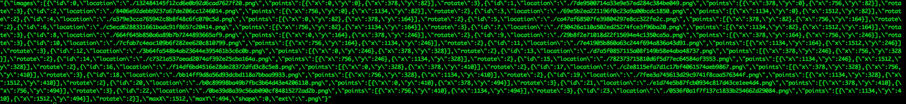

# imageEncrypt

imageEncrypt包提供对图片进行切片和随机旋转角度来达到对图片加密的效果；也可对切片后的图片进行复位拼装还原图片。
  
接口：Cut(对原始图片进行切片)、Assembe(切片后的图片进行还原)、Storage(对切片后的图片进行存储)、Meta(对切片后图片元信息进行存储)
  
依赖：go1.6、github.com/sosop/imaging(支持多种图片格式的简单操作)

# 安装


```
go get -u github.com/sosop/imaging
go get -u github.com/sosop/imageEncrypt
```

# 文档


```
PACKAGE DOCUMENTATION

package imageEncrypt
    import "."

    Package imageEncrypt assembe interface is restoring image


    Package imageEncrypt cut is Cutting Image

    Package imageEncrypt models


    Package imageEncrypt meta information

    Package imageEncrypt storage is storing the splice image

CONSTANTS

const (
    // DefaultPatitionX default cols
    DefaultPatitionX = 4
    // DefaultPatitionY default rows
    DefaultPatitionY = 4
)

const (
	 // shape of cutting
    Rectangle = iota
    RightTriangle

    // Degree0
    Degree0 = iota
    // Degree90
    Degree90
    // Degree180
    Degree180
    // Degree270
    Degree270
)
    

TYPES

// Assembe it's a interface. Implement this interface
type Assembe interface {
}
    
// Cut interface
type Cut interface {
    Cutting(reader io.Reader, filename string, condition ...interface{}) (MetaCuttedImage, error)
}
    
//  CuttedImage splice image
type CuttedImage struct {
    ID       int     `json:"id"`
    Location string  `json:"location"`
    Points   []Point `json:"points"`
    Rotate   int     `json:"rotate"`
}
   
// FileStorage Use file system to store splice image
type FileStorage struct {
}
    
// NewFileStorage constructor
func NewFileStorage(dir string) *FileStorage
    
// FileSystemAssembe Read slice image from the file system and restore
type FileSystemAssembe struct {
}
   
// NewFileSystemAssembe constructor
func NewFileSystemAssembe(s Storage, m Meta) *FileSystemAssembe
    

// Meta interface of meta information
type Meta interface {
}
    
// MetaByRedis Use redis store the meta info
type MetaByRedis struct {
}
    
// NewMetaByRedis constructor
func NewMetaByRedis(addr, pass string) *MetaByRedis
    
// MetaCuttedImage meta information
type MetaCuttedImage struct {
    Images []CuttedImage `json:"images"`
    MaxX   int           `json:"maxX"`
    MaxY   int           `json:"maxY"`
    Shape  int           `json:"shape"`
    Ext    string        `json:"ext"`
}
   
// Point
type Point struct {
    X int `json:"x"`
    Y int `json:"y"`
}
    
// RectangleCut cutting image to litle Rectangle image
type RectangleCut struct {
}

// NewDefaultRectangleCut constructor
func NewDefaultRectangleCut(storage Storage, meta Meta) *RectangleCut
    
// NewRectangleCut constructor
func NewRectangleCut(partitionX, patitionY int, storage Storage, meta Meta) *RectangleCut
    
// Cutting implement the interface of Cut
func (r RectangleCut) Cutting(reader io.Reader, filename string, condition ...interface{}) (*MetaCuttedImage, error)
    
// Storage interface
type Storage interface {
}

SUBDIRECTORIES

	test-asserts
```

# Examples

切割原始图片
	
```
	// 切片图片为文件存储方式，存储路径为当前目录
	s := imageEncrypt.NewFileStorage("./")

	//元信息用redis存储
	m := imageEncrypt.NewMetaByRedis("127.0.0.1:6379", "test")

	// 将图片切割为6行4列
	c := imageEncrypt.NewRectangleCut(4, 6, s, m)

	// 读取将要切割图片
	f, err := os.Open("/Users/mac/Downloads/test1.png")
	if err != nil {
		return
	}
	defer f.Close()

	// 第一个参数：文件流
	// 第二个参数：图片名
	// 第三个参数：元信息存储的查询条件(这里表示redis中的key)
	c.Cutting(f, "test1.png", "test-1")
```
元信息


还原图片
	
```
	// 元数据存储接口
	m := NewMetaByRedis("127.0.0.1:6379", "test")

	// 切片图片存储接口
	s := NewFileStorage("./")

	// 还原图片
	a := NewFileSystemAssembe(s, m)
	_, _, err := a.Assembing("test1")
	if err != nil {
		log.Fatal(err)
	}
```

注：
需要自定义切片图片的存储方式可以实现Storage接口，可以使用文件系统、云存储等

```
// Storage interface
type Storage interface {
	Save(image *CuttedImage, subImage image.Image, filename string, wg *sync.WaitGroup, exts ...string)
	Get(path ...string) (io.ReadCloser, error)
}
```

需要自定义切片图片元数据存储方式，实现Meta接口，可以用数据库、缓存、文件等方式

```
// Meta interface of meta information
type Meta interface {
	Save(metaImage MetaCuttedImage, condition ...interface{}) (interface{}, error)
	Get(condition ...interface{}) (MetaCuttedImage, error)
}
```


